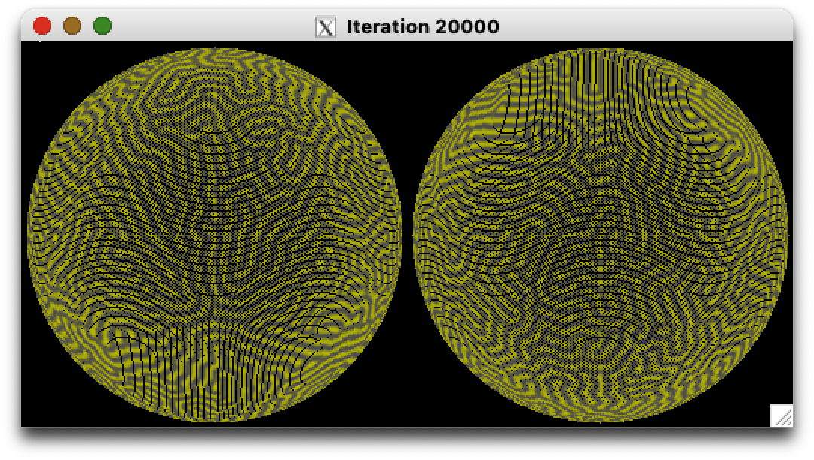
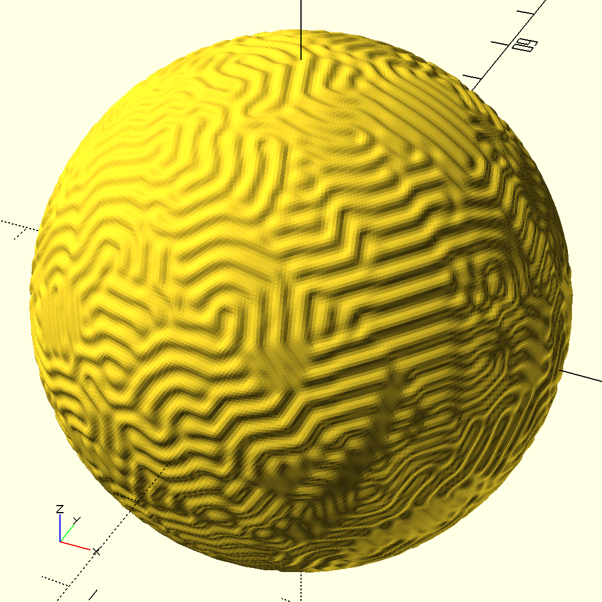

# Brain Coral - Spherical Gray-Scott Reaction-Diffusion

Brain coral is simulated via Gray-Scott reaction-diffusion (GSRD) over a spherical 3D surface.  Through this simulation, we hope you will gain an appreciation of the natural life form.  Let us all help preserve it from the ever changing environment so future generations will continue to be inspired by the beauty of nature.

We put a lot of thought into this brain coral.  This is not a 2D grid wraparound which only makes a torus or donut shape.  Instead, we approximate a sphere using a subdivided icosahedron mesh, yielding the familiar geodesic grid pattern.  We need to compute the Laplacian matrix over a non-flat mesh surface.  Rather than using a constant 2D Laplacian stencil, discrete exterior calculus gives us a cotangent formula to compute the Laplacian at each and every point for an irregular 3D mesh.

The code has been refactored to utilize multi-threaded computation over the vertex points in the mesh, which is able to gain significant speed up over single-threaded code.

An X11 window displays two hemispherical point clouds to monitor the progress of the simulation.  While the code with X11 omitted could still compute, a graphical display is useful for spotting any undesirable simulation so you can abort it short of finishing all iterations.

Prior to exiting, the simulated brain coral is saved as ready-to-run OpenSCAD code, which renders a design about 2 inches in diameter.  You can use that to create a 3D print of the brain coral.

The code has been tested with gcc on linux and with clang on MacOS.

Command line parameters [default value]:

	number of iterations [20000]
	feed rate [0.0256]
	kill rate [0.0544]
	scale [0.2]

Feed rate (F): 0.02 to 0.06 are typical F values.  The larger the value, the slower the simulation (i.e. more iterations necessary to 'fill' the surface of the sphere).

Kill rate (K): Note - bifurcation value K_bif=sqrt(F)/2-F.  Typical kill rate ranges from 0.002 below to 0.005 above the bifurcation value.  Kill rates below the bifurcation value tend to produce a simulation still in flux even when completely filled.  Kill rates above the bifurcation value tend to run slower in simulation, in which case the number of iterations should be raised to allow for complete filling.  Kill rates high above the bifurcation value tend to generate round spots or patches, which gives a 'natural' way to pack such patches over a spherical surface.

Scale: Large 1:1 (1.0) scale to small 1:10 (0.1) scale are typical.  A smaller scale packs 'more' or 'narrower' grooves over the same surface area, but tends to run slower.

Other code settings [default value]:

Mesh detail (MESH_DETAIL [99]) is number of cuts on a icosahedron's edge (0 for undivided).  The default value generates 100 equal arc subdivisions, creating 100002 vertices and 200000 triangular facets to approximate a sphere.  Higher detail increases the resolution like using a smaller scale, but also requires more computation.

Number of threads (N_THRDS [8]): You can actually set this higher than the number of CPU hardware cores or hyperthreads and let the OS juggle the software threads; just do not expect speed improvement beyond the point of full hardware utilization.

Initialization point (INIT_CENTER [0]): The initialization point and its vicinity are seeded to set off the simulation.  Seed placement and the number of initialization points can affect the final appearance.  More initialization points well spread out may fill the surface faster.

Feature	size (Feature [1/32.]): The feature size controls the depth of the grooves in the OpenSCAD 3D brain coral model.

May 4th, 2025
